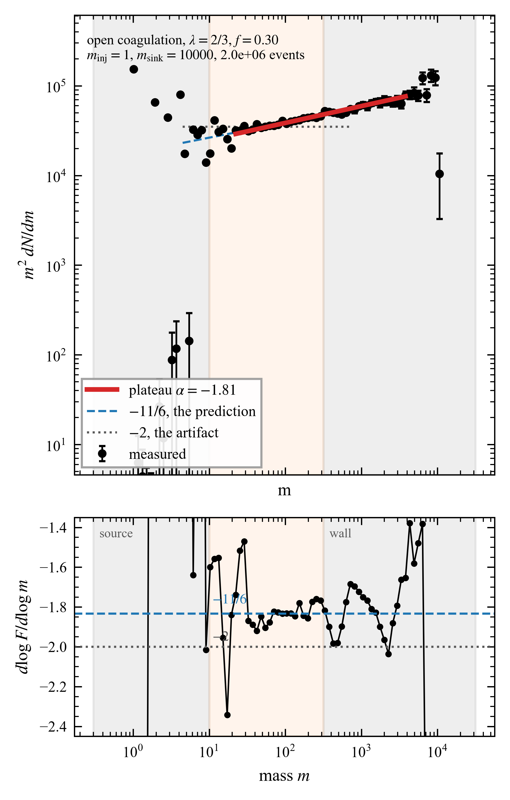
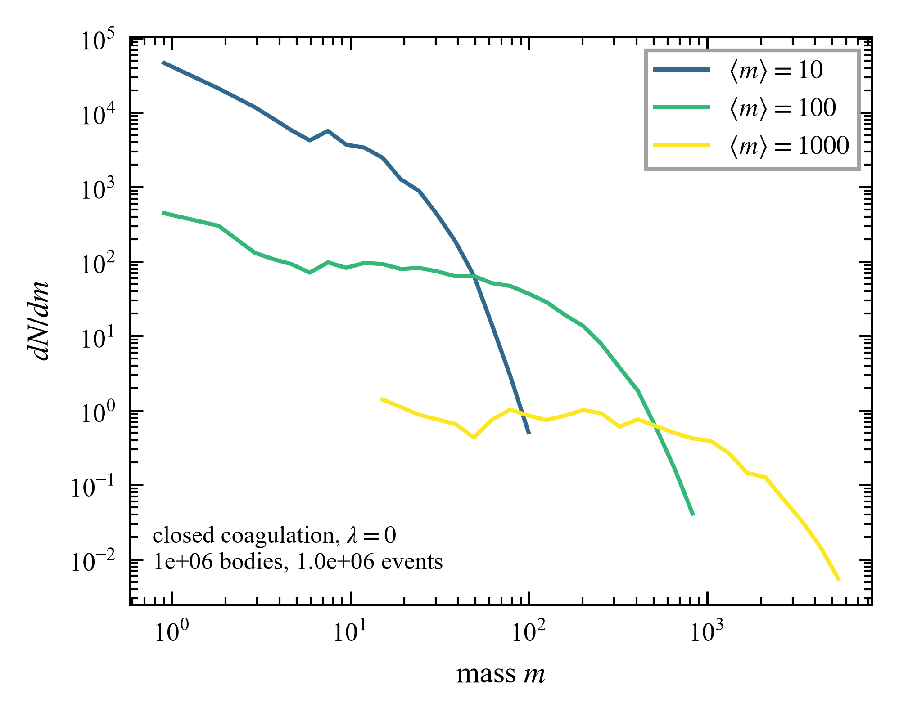
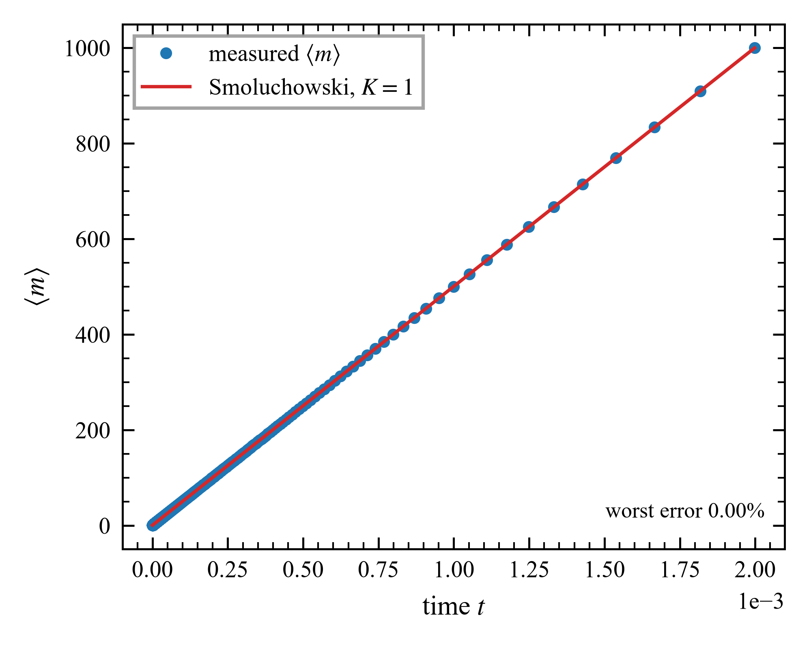
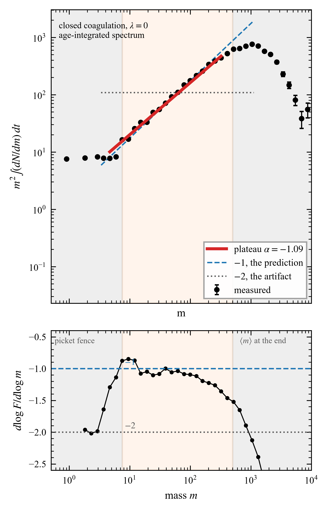
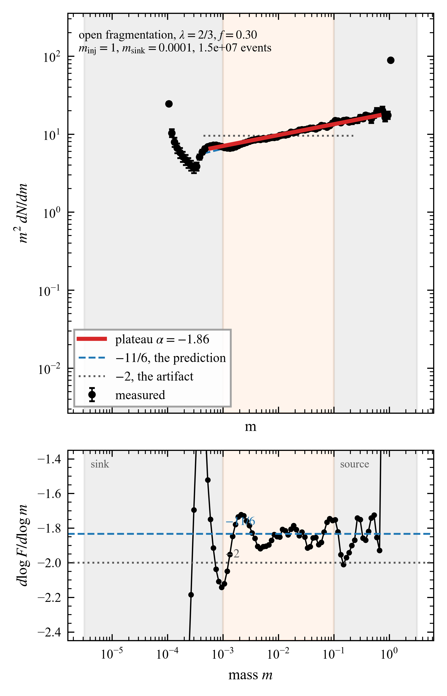
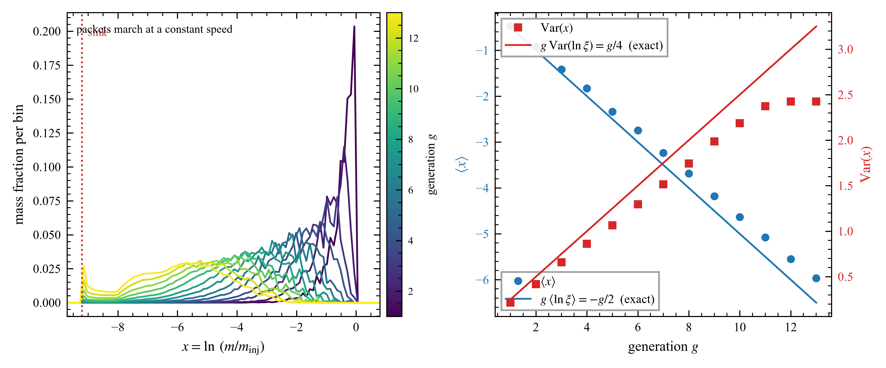
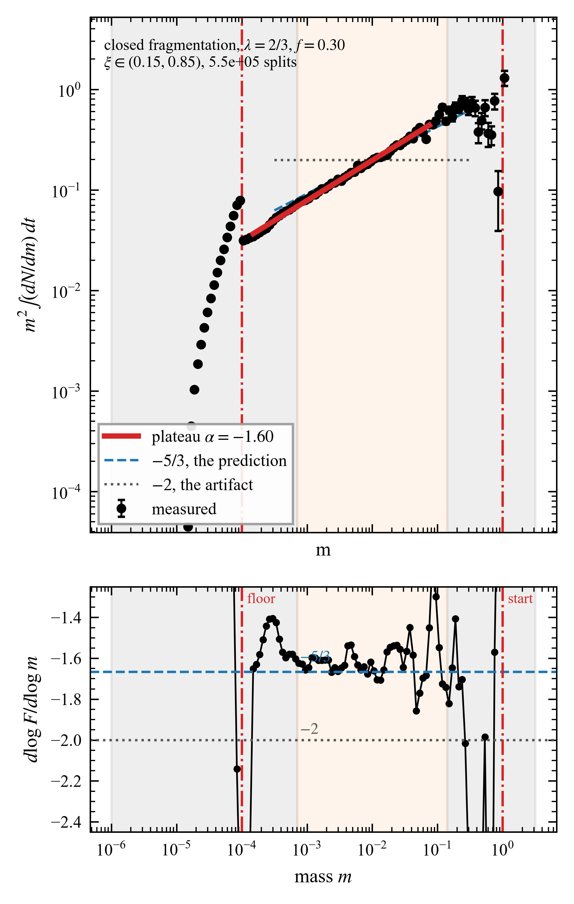

# MassCascadeMC

A Monte Carlo engine for mass cascades: bodies that merge into bigger ones, or
break into smaller ones, over many decades of mass. Coagulation and
fragmentation, in a closed box or with a source and a sink, all from one code
path.



One simulated particle is one real particle. There is no resampling and no
variable weights, so the total mass is conserved exactly and the reported
`mass_drift` is zero rather than small. What this costs is dynamic range: to
cover more decades you need more particles, and there is no shortcut.

## What the code does

Four configurations, from two switches:

```
process = "coagulation" | "fragmentation"
system  = "closed"      | "open"
```

Everything the four have in common — how a pair of particles is chosen, how the
clock advances, how the histograms are kept — is written once. What differs is
only what an accepted event does to the two particles, and what happens at the
edges of the mass range. An open system can have a source that injects bodies at
a fixed mass and rate, an absorbing wall at one end, and a distributed sink that
removes bodies everywhere at a mass-dependent rate.

## What is measured

The engine integrates a mass cascade with the collisional kernel `K = sigma v`,
homogeneous of degree `lambda`. Two configurations, two predictions.

**Closed.** Nothing enters and nothing leaves, and the total mass is conserved
exactly. There is no steady spectrum: the characteristic scale grows
self-similarly, `s' ~ s^lambda`, so a scale near `m` is occupied for a residence
time `dt ~ m^(1-lambda)`, during which the mass per decade there is of order the
total `M`. The time-integrated spectrum follows from `m^2 N(m) ~ M dt`:

```
alpha = -(1 + lambda)
```

**Open.** Bodies enter at one end and leave at the other, and the cascade
carries a constant flux in mass space, `J ~ m^(3+lambda) n^2 = const`
(Kolmogorov-Zakharov):

```
alpha = -(3 + lambda)/2
```

which is `-11/6` for the geometric cross section used here.

Each example measures one of these against its analytic value; the four cover
`-1`, `-5/3` and `-11/6`.

## Files

| file | what it is |
| --- | --- |
| `masscascade.py` | the engine. `simulate(...)` runs one cascade and returns arrays plus a record of the full configuration |
| `analysis.py` | the measurement layer: spectral index with an error bar, the range over which a power law actually holds, generation and age statistics, tests for whether a run has settled |
| `run_local.py` | the long experiment: eight independent copies, run for hours |
| `chi2_passes.py` | the settling test: does the first half of a long run agree with the second half? |
| `NUMERICS.txt` | why the engine is built the way it is, as numbered notes `[1]`–`[21]` |
| `examples/` | four short scripts, described below |

## Examples

Four self-contained scripts. Each runs one cascade, measures it with the
analysis layer, and writes its figures to `examples/figures/`. They are also
worked examples of how to call the two modules.

```bash
cd examples
python ex1_closed_selfsimilar.py
python ex2_open_steady.py
python ex3_fragmentation_generations.py
python ex4_closed_fragmentation.py
```

Each one prints its own numbers next to the prediction and reports how long it
took. Three are quick — under a minute, a minute and a half, under a minute —
and `ex3` is the long one at about nine minutes, because it is the only example
where the spectrum, the generations and the settling test all have to hold at
the same time. `MAX_EVENTS` at the top of each file is the dial.

Between them the four cover three different predictions — `-1`, `-11/6` and
`-5/3` — each against its own analytic value.

### 1. Closed coagulation



A million bodies of mass 1 merge until a thousand are left. Nothing enters and
nothing leaves, so the spectrum never settles: it just walks towards larger
masses. The figure shows one snapshot per decade of mean mass.



The clock is checked against Smoluchowski's exact solution, which for this
kernel is a straight line on linear axes. If the mean mass came out exponential
instead, it would mean the particle weights had dropped out of the time step.



A closed box has no steady spectrum, but it does have one integrated over time,
and that is the measurement. For this kernel the answer is known exactly:
`alpha = -1`. Below `m = 4` the histogram reads `-2` instead, and that is worth
understanding — every mass here is a whole multiple of the starting mass, so at
small masses the spectrum is a set of separate lines. A narrow logarithmic bin
holds one line or none, and dividing that one line by a bin width that grows
with mass turns `1/k` into `1/m^2`. That value is manufactured by the binning
alone, with nothing wrong in the physics, and finer bins make it worse rather
than better. The fit starts above it.

### 2. Open coagulation

The figure at the top of this page. Bodies enter at `m = 1`, merge upward, and
are absorbed at `m = 1e4`. The prediction is `-11/6`.

The injection rate is measured, not guessed. In a steady cascade, injections and
merges happen at the same rate, so a short trial run measures how fast merges
happen and the injector is set to match. Get this wrong and the box slowly
empties, which looks like noise in the spectrum but is not.

A locality condition is on, `f = 0.30`: two bodies merge only if the lighter is
at least `f` times the heavier. Without it a large body grows mostly by
swallowing fresh injections, which is an effect of the boundary rather than a
cascade. The exponent does not depend on `f`, because the condition involves
only the ratio of the two masses; what changes is how fast the cascade runs.

The fitting window is not symmetric, and the grey bands on the figure show why.
At the bottom, masses are whole multiples of the injected one and the histogram
is a picket fence of separate lines, which no amount of extra particles will
smooth. At the top, the absorbing wall distorts the spectrum for about a decade
and a half. The window is the one the long runs use.

### 3. Open fragmentation



The same thing in reverse: whole bodies enter at `m = 1`, break up on the way
down, and leave at `m = 1e-4`. The constant-flux argument does not care which
direction the cascade runs, so the prediction is again `-11/6`. Two different
processes, opposite directions, one exponent.



The second figure shows where the power law comes from. Every particle carries
the number of breakups between it and the body that entered, and each such
generation forms a packet that marches down in mass at a steady speed. The lines
drawn through the measurements are not fits: a split that divides the mass in a
uniformly random ratio moves a body by a known amount on average, with a known
spread, and those two numbers are what is drawn. A constant step at a constant
rate is a renewal process, and a renewal process that is uniform in the
logarithm of mass is `1/m` in mass.

### 4. Closed fragmentation



A hundred bodies break up inside a closed box until the mean mass reaches a
floor, below which nothing breaks further. No source, no sink, so the
measurement is again the spectrum integrated over time, and the prediction for a
closed box is `-5/3`.

The splits here are limited: a fragment is never lighter than 15% of its parent.
That restriction is what makes the closed box workable. With unrestricted splits
a body just above the floor can throw off a fragment several decades below it,
which then freezes there for ever. Such dust holds almost none of the mass and
almost all of the bodies, and since the spectrum counts bodies, it buries the
cascade. The sink in example 3 solves the same problem the other way.

## Running it properly

The examples are not the measurement. They take minutes and each is a single
run, so the error bar on the exponent covers only the scatter inside one box.
The real measurement is `run_local.py`, which runs eight independent copies with
different random seeds, in parallel, for hours.

The eight copies are the point. The spread between independent seeds is the
honest uncertainty on the exponent; anything a single run reports is smaller and
answers a different question.

Start by asking what the options are:

```
python run_local.py --help
```

Then give each process an hour and look at the result before committing a night
to it. Run them one after the other, not in two windows at once — sixteen
processes on twenty cores finish less total work than eight, because they
compete for memory bandwidth rather than for arithmetic:

```
python run_local.py --process coag --add-hours 1
python run_local.py --process frag --add-hours 1
```

If that looks sensible, add three more hours to each. `--add-hours` adds to what
each copy has already done, so this can be repeated as often as you like, and
the run picks up from disk where it stopped:

```
python run_local.py --process coag --add-hours 3
python run_local.py --process frag --add-hours 3
```

The figures can be redrawn from stored results without running anything again:

```
python run_local.py --process coag --stack-only --iso-dlogm 0.5
```

Two lines in the output decide whether a run is worth reading. **`drift per
decade`** should be zero within its error; that is what says the spectrum is a
power law. An average slope sitting near `-11/6` does not say it, because an
average taken across a sloping curve can land on the right answer by accident.
**`half-vs-half`** compares the first half of the run against the second: read
the median against the scatter, and look at the mass where the worst bin sits. At
the top of the range it is the wall still filling up, which is expected; in the
middle it means the box has not settled yet, which is not.

For fragmentation the answer can be probed instead of assumed. Starting the box
from the predicted slope and recovering that slope proves nothing, so start it
from two wrong ones, one above and one below. If both relax onto `-11/6` it is a
measurement; if only the one started there stays put, it is an artefact:

```
python run_local.py --process frag --start seed --seed-alpha -1.5 --add-hours 2
python run_local.py --process frag --start seed --seed-alpha -2.1 --add-hours 2
```

### Has the box actually settled?

`chi2_passes.py` answers that, and it answers it by counting rather than by
averaging. It reads the results already on disk and runs nothing itself:

```
python chi2_passes.py --process coag
python chi2_passes.py --process frag
```

It splits the stored passes into an early group and a late group and asks
whether the two spectra differ by more than the number of particles behind them
allows. This is a different question from the one the error bars answer. The
spread over the eight copies measures the random part only: the copies differ
just in their random seed, so anything systematic — a box still relaxing, the
choice of window, curvature in the spectrum — is identical in all eight and
invisible to it.

The output has two blocks and they are meant to be read together. The first
treats every count as independent, which it is not — snapshots taken close
together in one pass see almost the same box — so that number always reads high.
Use it to see **where** the two halves disagree: a box still relaxing shows a run
of same-sign deviations across neighbouring masses, not scatter. The second
block uses the spread across the eight copies as the error, which has honest
degrees of freedom, and that one says **whether** the disagreement is real. A
value near one there means the two halves agree within the spread of independent
seeds, and the box has stopped moving.

### One practical warning

The runner writes eight state files of about 11 MB at every checkpoint. If
`runs/` sits inside a synced folder such as OneDrive or Dropbox, that is roughly
a gigabyte an hour to re-upload, and the sync program may hold a file open at
the moment the run tries to replace it. The run survives a power cut, but not
another program's lock. Exclude the folder from syncing before the first long
run.

`NUMERICS.txt` is the third layer: numbered notes explaining why each choice in
the engine was made, including the ones this page refers to — the clock, the
locality condition, and when a cascade needs one at all.

## Conventions

`dndm` is a density in mass: the count in a bin divided by the width of the bin
and by the volume. A slope quoted as `dN/dm ~ m^alpha` corresponds to
`dn/dln m ~ m^(alpha+1)` if you prefer logarithmic bins.

Reproducibility is up to the caller. Create the random generator with an
explicit seed and store that seed alongside the output; the engine does not
record it. The `seed` field in the saved metadata means something else — the
power-law used to build the starting population.

Saved runs carry their own configuration, so a stored file can be analysed later
without knowing which script produced it.

## Requirements

Python 3 with numpy; the analysis layer and the examples also need matplotlib.

## License

MIT. See `LICENSE`.

## Reference

The local-slope diagnostic used in the spectrum figures is the one in Laor &
Gitelman, *Phys. Rev. E* **113**, 044135.
